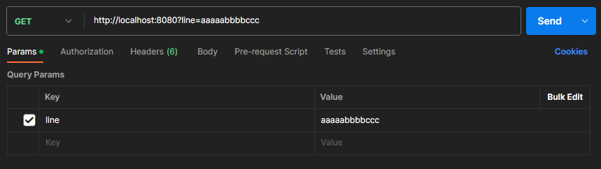
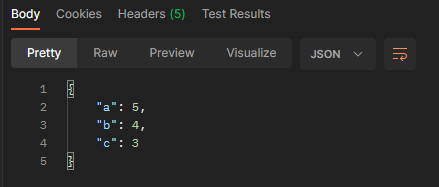

# spring-test

## How to run:
Just execute ``gradlew bootRun``

## How to check it works:
Send `GET` request using Postman with your line in query parameter

You will receive JSON with count of every symbol in your input
